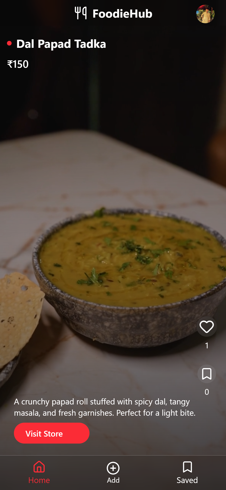
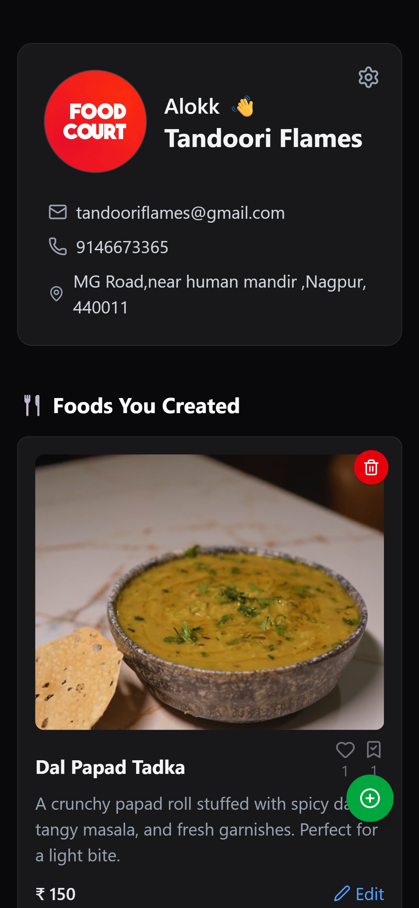

 `alokkkxpixel/Food-View` repository with technology badges and authentication API endpoints. <cite/>

# FoodieHub


A TikTok-style video platform for food discovery where users can browse food videos and food partners can showcase their offerings. <cite/>

## 📱 Mobile Preview

Here’s how the app looks on a mobile viewport (simulated):

| Screen | Description |
|---|---|
  | | Vertical “TikTok-style” video scroll feed |
 | | Food partner upload / management view |

> *You can place mobile screenshots under a `docs/` folder (e.g. `docs/mobile-home.png`, `docs/mobile-upload.png`, etc.).*

---

## 🚀 Features

### For Regular Users
- Browse vertical video feed of food content
- Like and save food videos  
- View saved content
- Profile management with account settings

### For Food Partners
- Upload and manage food videos
- Update food prices and delete items
- Track engagement metrics

## 🛠️ Tech Stack

**Frontend:**
- React 19.1.1 [1](#1-0) 
- Tailwind CSS 4.1.13 [2](#1-1) 
- Vite 7.1.2 [3](#1-2) 
- Axios for API calls [4](#1-3) 
- GSAP for animations [5](#1-4) 

**Backend:**
- Express.js with Node.js [6](#1-5) 
- MongoDB for data persistence
- JWT Authentication [7](#1-6) 
- ImageKit for media storage [8](#1-7) 
- bcrypt for password hashing [9](#1-8) 

## 🔐 Authentication API Endpoints

### User Authentication
| Method | Endpoint | Description | Middleware |
|--------|----------|-------------|------------|
| `POST` | `/api/auth/user/register` | Register new user with profile image | `multer.single("image")`, `registerUserValidator` |
| `POST` | `/api/auth/user/login` | User login with email/password | None |
| `POST` | `/api/auth/user/logout` | User logout | None |
| `DELETE` | `/api/auth/user/:id` | Delete user account | None | [10](#1-9) 

### Food Partner Authentication
| Method | Endpoint | Description | Middleware |
|--------|----------|-------------|------------|
| `POST` | `/api/auth/foodpartner/register` | Register new food partner | `multer.single("image")`, `registerFoodPartnerValidator` |
| `POST` | `/api/auth/foodpartner/login` | Food partner login | None |
| `POST` | `/api/auth/foodpartner/logout` | Food partner logout | None |
| `DELETE` | `/api/auth/foodpartner/:id` | Delete food partner account | None | [11](#1-10) 

### Authentication Middleware
- **`authUserMiddleware`**: Validates JWT tokens for regular users [12](#1-11) 
- **`authFoodPartnerMiddleware`**: Validates JWT tokens for food partners [13](#1-12) 

## 📡 Additional API Routes

### Food Item Management
| Method | Endpoint | Description | Authentication |
|--------|----------|-------------|----------------|
| `POST` | `/api/food/` | Create food item with video | Food Partner |
| `GET` | `/api/food/` | Get paginated food items | User |
| `POST` | `/api/food/like` | Toggle like on food item | User |
| `POST` | `/api/food/save` | Save food item | User |
| `GET` | `/api/food/savedfood` | Get saved food items | User |
| `DELETE` | `/api/food/:id` | Delete food item | None |
| `PUT` | `/api/food/:id/price` | Update food price | None | [14](#1-13) 

### Food Partner Profile
| Method | Endpoint | Description | Authentication |
|--------|----------|-------------|----------------|
| `GET` | `/api/food-partner/profile` | Get logged-in partner profile | Food Partner |
| `GET` | `/api/food-partner/:id` | Get partner profile by ID | Food Partner | [15](#1-14) 

## 🏗️ Architecture

The platform follows a three-tier architecture:
- **Frontend**: React SPA with routing [16](#1-15) 
- **Backend**: Express.js REST API [17](#1-16) 
- **Database**: MongoDB with Mongoose ODM
- **Storage**: ImageKit CDN for media files

## 🚦 Getting Started

1. **Clone the repository**
   ```bash
   git clone https://github.com/alokkkxpixel/Food-View.git
   cd Food-View
   ```

2. **Backend Setup**
   ```bash
   cd backend
   npm install
   ```
   
3. **Frontend Setup**
   ```bash
   cd frontend
   npm install
   ```

4. **Environment Variables**
   Create `.env` files with:
   - `JWT_SECRET`
   - `IMAGEKIT_PUBLIC_KEY`
   - `IMAGEKIT_PRIVATE_KEY`
   - `IMAGEKIT_ENDPOINT`
   - MongoDB connection string

5. **Start Development Servers**
   ```bash
   # Backend (port 3000)
   cd backend && npm start
   
   # Frontend (port 5173)
   cd frontend && npm run dev
   ```

## 📱 Frontend Routes

The application uses React Router for navigation: [18](#1-17) 

- `/user/register` - User registration
- `/user/login` - User login
- `/foodpartner/register` - Food partner registration
- `/foodpartner/login` - Food partner login
- `/home` - Main video feed
- `/savedfood` - Saved content
- `/create-food` - Upload food content
- `/food-partner/profile` - Partner dashboard

**Notes**

The codebase implements a comprehensive dual-authentication system supporting both regular users and food partners, with role-based access control and secure JWT token management. The API follows REST conventions with proper middleware validation and file upload handling via multer and ImageKit integration.

Wiki pages you might want to explore:
- [System Architecture (alokkkxpixel/Food-View)](/wiki/alokkkxpixel/Food-View#2)
- [API Routes (alokkkxpixel/Food-View)](/wiki/alokkkxpixel/Food-View#3.1)
- [Controllers & Business Logic (alokkkxpixel/Food-View)](/wiki/alokkkxpixel/Food-View#3.2)

### Citations

**File:** frontend/package.json (L15-15)
```json
    "axios": "^1.11.0",
```

**File:** frontend/package.json (L20-20)
```json
    "gsap": "^3.13.0",
```

**File:** frontend/package.json (L23-23)
```json
    "react": "^19.1.1",
```

**File:** frontend/package.json (L27-27)
```json
    "tailwindcss": "^4.1.13"
```

**File:** frontend/package.json (L39-39)
```json
    "vite": "^7.1.2"
```

**File:** backend/src/app.js (L2-2)
```javascript
const express = require("express");
```

**File:** backend/src/app.js (L20-23)
```javascript
//Routes
app.use("/api/auth", authRoutes);
app.use("/api/food", foodItemRoutes);
app.use("/api/food-partner", foodpartnerRoutes);
```


```
